---
title: Demo Script - 45-Second Host-Aware Flow
slug: /demo/host-aware-flow
---

# Demo Script - 45-Second Host-Aware Flow

## Killer Scenario

Checkout confirmation flow across layered UI surfaces:

- Root app save confirmation
- Modal payment failure
- Bottom sheet validation warning
- Duplicate retry collapse
- Async upload lifecycle (loading -> success/error)
- Keyboard-safe bottom toast

## Step-by-Step Demo Script (Muted-Friendly, `<=45s`)

| Time | Action | On-Screen Text (for muted viewing) | Expected behavior |
| --- | --- | --- | --- |
| 0:00-0:05 | Tap `Save Profile` on root screen. | `Root host toast` | Success toast appears in root host only. |
| 0:05-0:10 | Open payment modal. Tap `Submit Card`. | `Modal host toast` | Error toast appears inside modal layer (not behind modal). |
| 0:10-0:16 | Open coupon bottom sheet. Tap `Apply Coupon`. | `Sheet host toast` | Warning toast appears in sheet host near active surface. |
| 0:16-0:22 | Tap `Retry Sync` twice quickly. | `Dedupe: one toast, no stack spam` | Only one retry toast remains visible (dedupe key/behavior applied). |
| 0:22-0:31 | Tap `Upload Receipt` once. | `Promise: loading -> success` | Loading toast transitions to success in-place. |
| 0:31-0:39 | Focus sheet input to open keyboard, then tap `Show Bottom Toast`. | `Keyboard-aware bottom toast` | Bottom toast shifts above keyboard and stays readable. |
| 0:39-0:45 | Close sheet + modal. Tap `Done`. | `Back to root host` | Final root success toast confirms host routing continuity. |

## Expected Behavior Checklist

- [ ] Root action shows toast in root host.
- [ ] Modal action shows toast in modal host layer.
- [ ] Bottom sheet action shows toast in sheet host layer.
- [ ] Duplicate retry taps do not create stacked duplicates.
- [ ] Promise flow visibly transitions `loading -> success` (or `loading -> error` on failure run).
- [ ] Bottom-positioned toast avoids keyboard overlap.
- [ ] Closing layered surfaces does not break root host toasts.

## Short Caption (GIF/Video)

Root success, modal error, sheet warning, deduped retries, promise loading-to-success, and keyboard-safe bottom toast in 45 seconds.

## Captured Clips

### Root host success

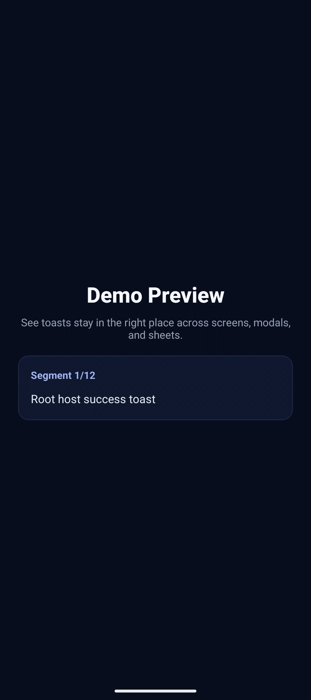

### Light theme preview

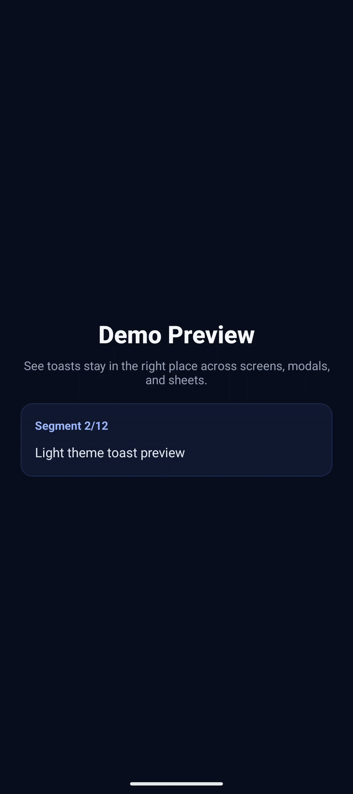

### RTL Arabic preview

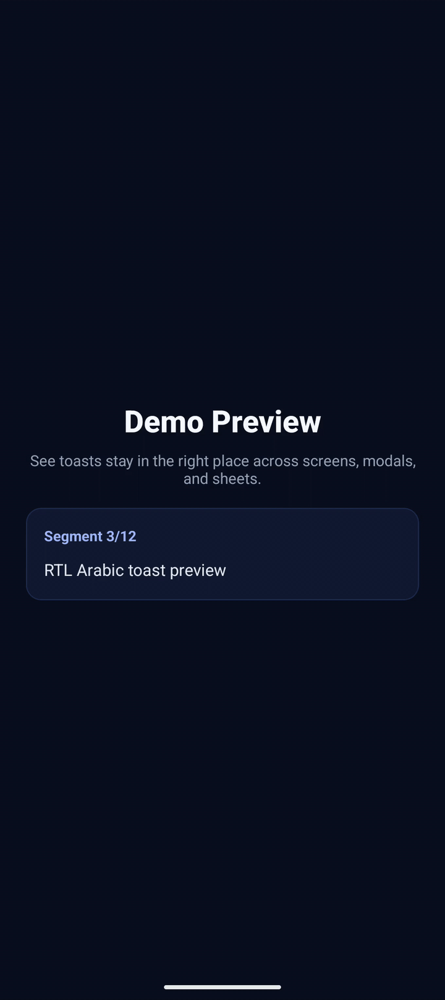

### Modal host scoped toast

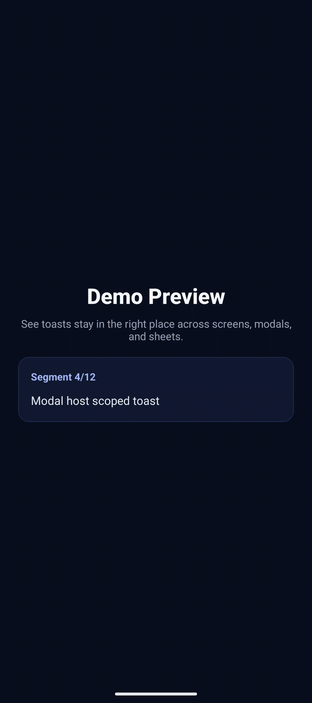

### Sheet host scoped toast

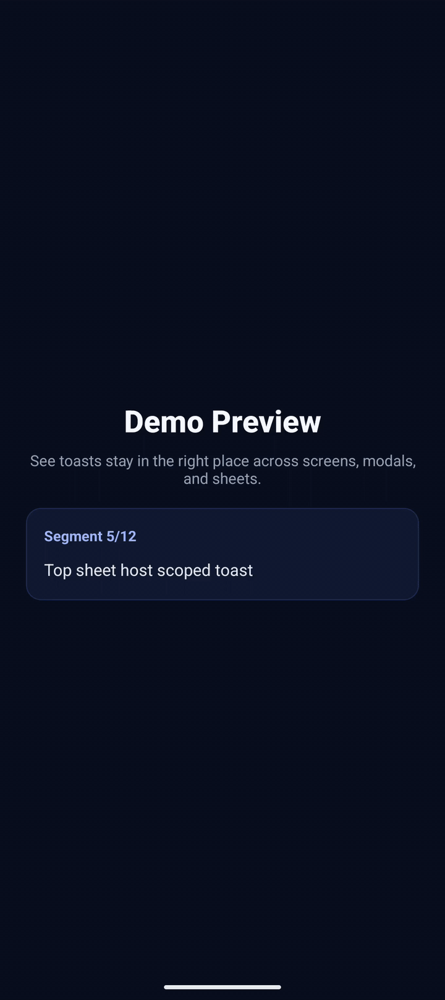

### Keyboard-aware bottom placement

### Action buttons

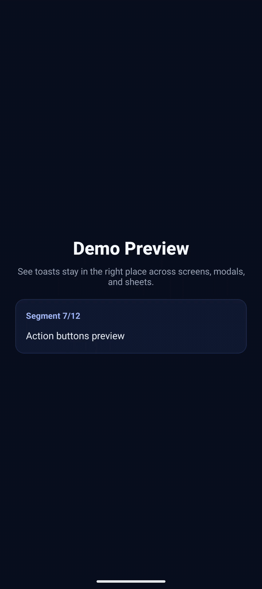

### Dedupe ignore

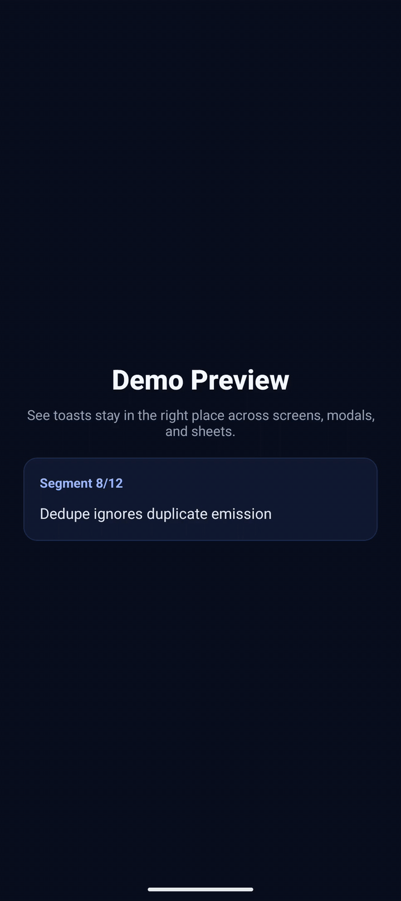

### Promise lifecycle

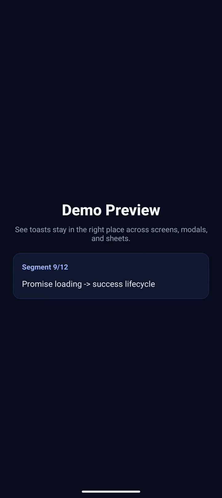

### Long content wrapping

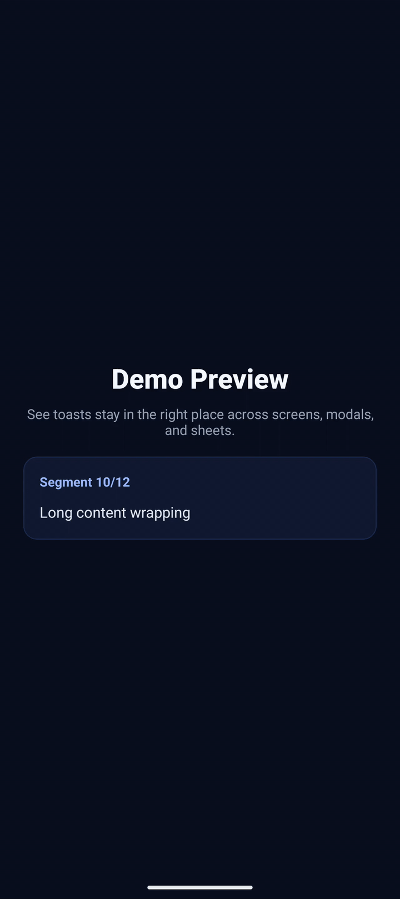

### Group update flow

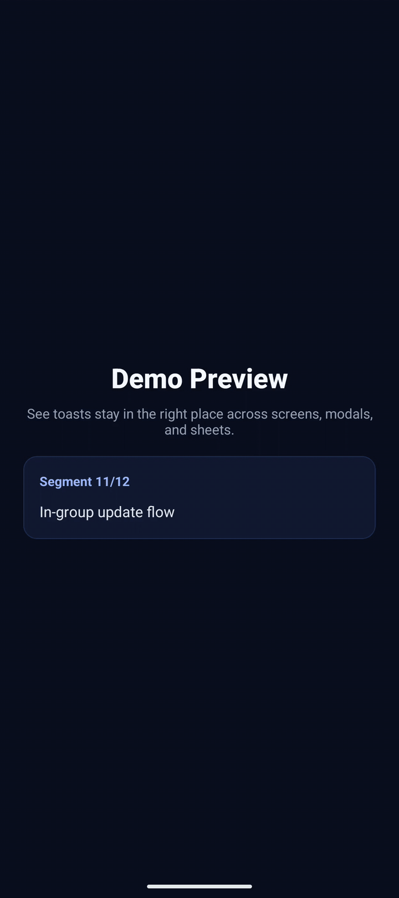

### Programmatic loading to success

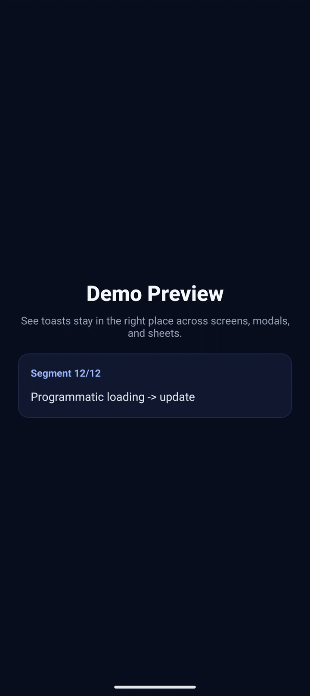

## Optional Shot List

1. Root screen CTA (`Save Profile`) and root success toast.
2. Modal open state and modal-scoped error toast.
3. Bottom sheet open state and sheet-scoped warning toast.
4. Rapid double tap on retry CTA showing dedupe behavior.
5. Promise CTA with loading then success transition.
6. Keyboard opened in sheet plus bottom toast avoiding overlap.
7. Return to root and final success confirmation.
